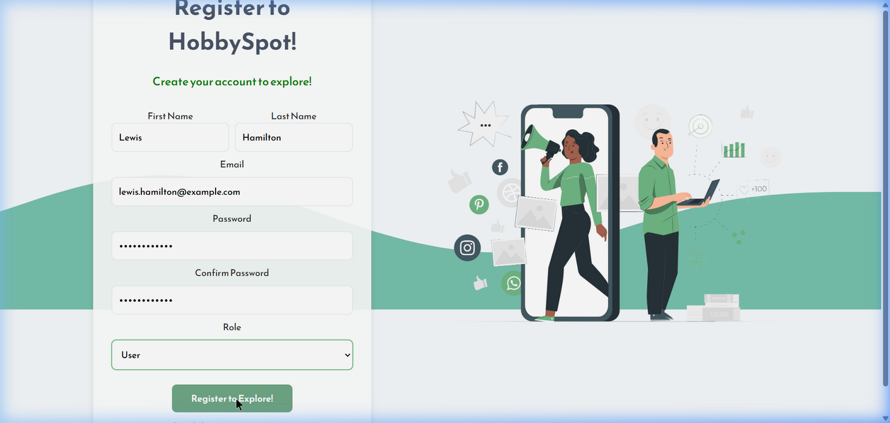
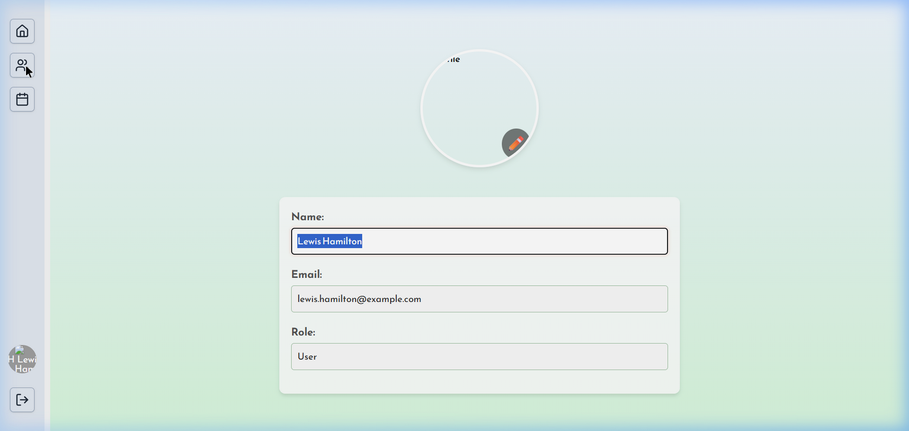
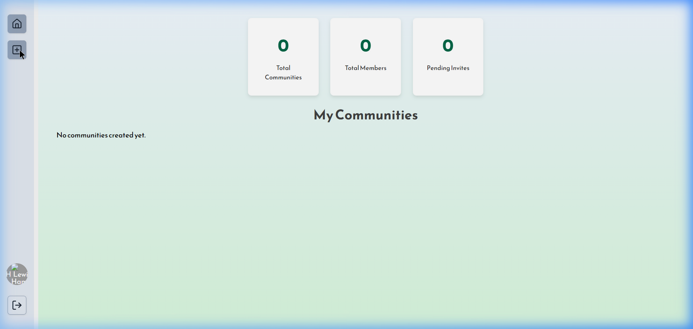

<div align="center">
  

  <h3 align="center">HobbySpot (Hobby Hub)</h3>

  <p align="center">
    A robust MERN stack platform for organizing communities, members, and scheduled events!
    <br />
    <br />
    <a href="https://hobby-hub-h8wb.vercel.app/">View Live Deployment</a>
  </p>
</div>

---

## 📖 About The Project

HobbySpot is a specialized social platform meticulously crafted to bridge the gap between community leaders, business owners, and general hobbyists. With distinct Role-Based Access Control (RBAC), the platform cleanly separates operational control from the end-user browsing experience.

### 👥 Role-Based Capabilities

The platform revolves around four distinct ecosystem roles:

1. **User**: Can browse available communities throughout the platform, request to join them, and interact directly with content and scheduled events.
2. **Community Admin**: Operates dedicated hubs. They have specialized dashboards authorizing them to create new communities, manage membership rosters, and approve incoming user requests.
3. **Business Owner**: Focuses exclusively on event planning. Empowered to create, schedule, and map physical/remote resources to unique events targeting the hobby communities.
4. **Admin**: The architectural overseer. They track all active users, community counts, and have explicit revocation (deletion) authority over accounts acting out of line.

### 📸 Application Showcase

| Registration | Dashboard & Navigation |
| --- | --- |
|  |  |
| *Intuitive registration forcing strict role selection* | *Clean sidebar navigation utilizing Material UI* |

<div align="center">
  
  <br>
  <em>Community Admins building dedicated groups (Image uploads are fully optional natively)</em>
</div>

---

## 🛠 Built With

* **Frontend:** React 18, Vite, TS, Redux Toolkit, Tailwind CSS, Material UI (MUI)
* **Backend:** Node.js, Express.js
* **Database:** MongoDB (Mongoose)
* **Authentication:** JWT (JSON Web Tokens) & Bcrypt

---

## 🚀 Getting Started Locally

To get a local copy up and running, follow these simple steps.

### Prerequisites

You will need the following installed:
* [Node.js](https://nodejs.org/en/) (v16+)
* [npm](https://www.npmjs.com/)
* [MongoDB locally](https://www.mongodb.com/try/download/community) or a cloud MongoDB Atlas URI.

### 1. Backend Setup (API Server)

1. Open a new terminal and navigate to the backend directory:
   ```bash
   cd backend
   ```
2. Install the necessary NPM packages:
   ```bash
   npm install
   ```
3. Create your local environment file:
   ```bash
   cp .env.example .env
   ```
   *Make sure your `.env` contains the following matching structure:*
   ```env
   PORT=5000
   MONGODB_URI=mongodb://127.0.0.1:27017/CommunityWebsite
   FRONTEND_URL=http://localhost:5173
   JWT_SECRET=your_super_secret_jwt_string
   ```
4. Start the development server!
   ```bash
   npm start
   ```
   *The server should report it is running on port 5000 and successfully connected to MongoDB.*

### 2. Frontend Setup (React App)

1. Open a **second separate terminal** and enter the frontend directory:
   ```bash
   cd frontend
   ```
2. Install the dependencies via npm:
   ```bash
   npm install
   ```
3. Create a `.env` file pointing to your local API.
   ```bash
   echo "VITE_API_BASE_URL=http://localhost:5000" > .env
   ```
4. Start the Vite development build:
   ```bash
   npm run dev
   ```

Your browser should output local addresses generated by Vite, typically `http://localhost:5173/`. Open it in your browser and start testing!

---

## 💡 Notes for Testing
When testing locally, it is highly recommended you create 4 distinct users initially—one for each role (Admin, User, CommunityAdmin, and BusinessOwner)—to truly map out and experience the platform's isolated feature sets.
